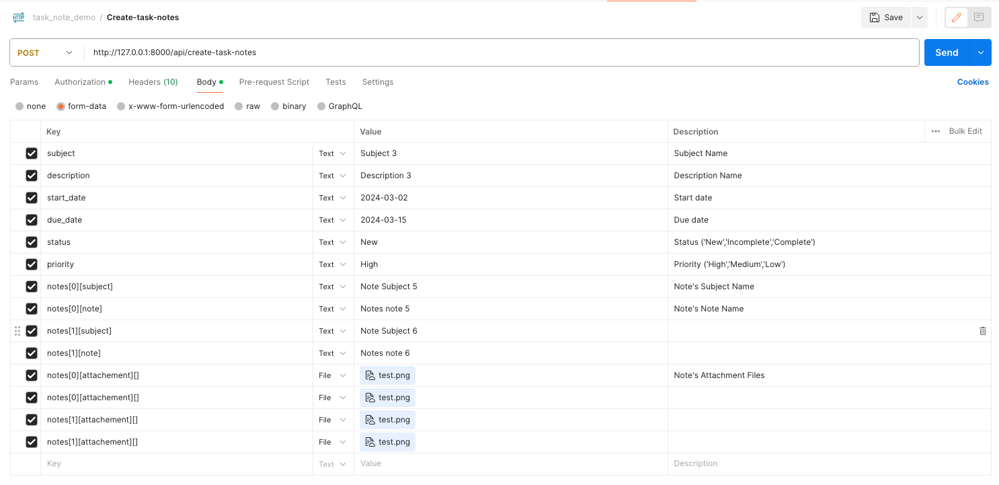
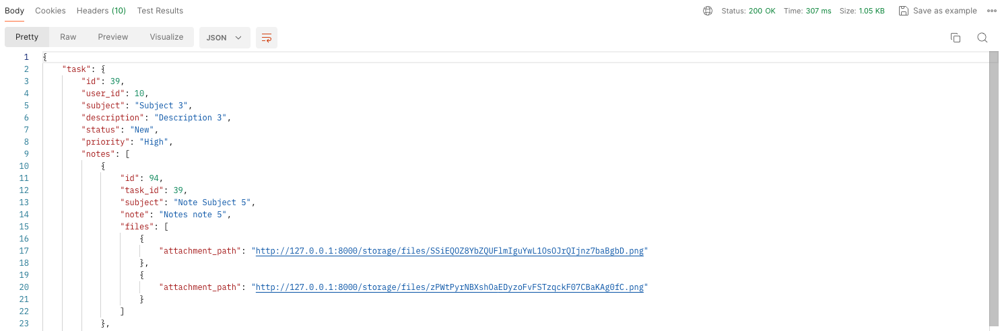
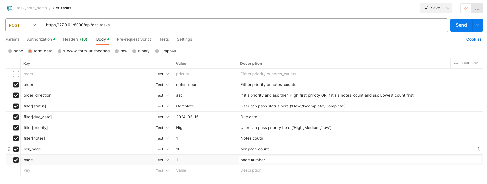
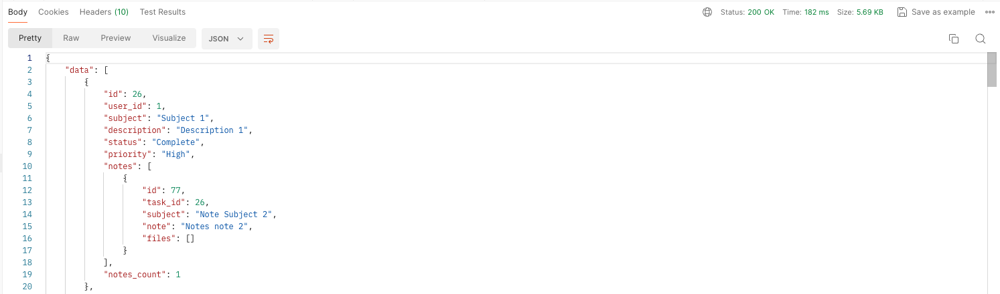

## About Project
- Create a module 'Task' which has multiple 'Notes' which has multiple 'Attachments'

- Create an API for Login and Register

- Create an API for get all tasks with order and filters and minimum one note attached

## Getting Started
## Clone the Repository
- git clone https://github.com/pringal/task_notes_demo.git
- Create an env file
``cp .env.example .env``
## Set Up Environment Variables
## Add Database configuration as per your setup in .env file from root
File: .env
```
DB_CONNECTION=mysql
DB_HOST=
DB_PORT=3306
DB_DATABASE=task_note
DB_USERNAME=
DB_PASSWORD=
```

## Install Dependencies
Run the following command to install the project dependencies:

```
cd task_notes_demo
composer install
````

## Run Migrations and Seed Database
Run the migrations to set up the database schema:

``php artisan migrate --seed``

## Setup Passport and generate keys

- `php artisan passport:keys`
- `php artisan passport:client --personal`

## API's

## Register API params
- name
- email
- password
- password_confirmation

## Login API params
- email
- password


## Login Credentials
Email | Password| 
--- | --- | 
admin@admin.com | password 


## Create Task with Notes and it's multiple attachments
- Here is the postman screenshot having all the params list and the data with param description.



- Response of the API will be like this



## Get All tasks API with filters and at least one note should each task have

- Here is the postman screenshot having all the params list and data with param description.



- Response of the API will be like this



- Here user will get the response of tasks and child notes of the tasks and the attachments of the notes.
